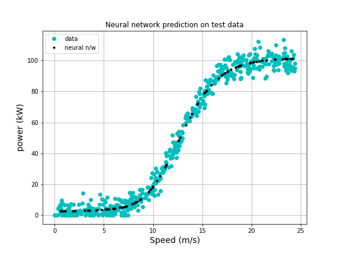

# Machine Learning and Statistics
### Project submission 2020
### Student Name : Sasikala Varatharajan
### Student Number : G00376470

### Machine Learning - Project file for ML 2020

This repository contains files for the project in the module 
Machine Learning and Statistics at GMIT.

### Project Description
This README describes work done for the Machine Learning and Statistics module project. In this project we have been asked to create a web service that uses machine learning to make predictions based on the data set powerproduction available on Moodle. The goal is to produce a model that accurately predicts wind turbine power output from wind speed values, as in the data set. we should then develop a web service that will respond with predicted power values based on speed values sent as HTTP requests. 

This repository contains

1. Jupyter notebook that trains a model using the data set.
Jupyter Notebook: ML_PowerPrediction_Project.ipynb

In this Jupyter Notebook, I have explained about the Models that I have trained using the given dataset "PowerProduction.csv". Before selecting the Neural Network with one hidden layer I have explained why Linear regression is not a good fit. I have also included the python function to predict the the Power output which is close to the predicted value from the trained model using the Neural network. The structure and state of this trained model is saved to the "Model_NN.h5" file included in the repository.

The Keras model is loaded into a python Flask web server application called "server.py" for use with the html user interface html page "Index.html".

Model Output:

Index page of the Project:

### Project Repository

This project is hosted on GitHub at https://github.com/SasikalaGV/MLProject2020

## Instructions for cloning the repository
A repository on GitHub exists as a remote repository. You can clone this repository to create a local copy on your computer by following these instructions:
1. On GitHub, navigate to the main page of the repository click Clone or download.
2. Choose "Clone with HTTPS" to copy the address.
3. Open a terminal on your machine. Change the current working directory to the location where you want the cloned directory to be made.
4. Type git clone, and then paste the URL you copied above:
git clone https://github.com/SasikalaGV/MLProject2020

5. Press enter to clone the repository to your machine.

### Static version of the notebook
Enter the GitHub url below to view the file.
https://github.com/SasikalaGV/MLProject2020/blob/main/ML_PowerPrediction_Project.ipynb

### Files included in the Repository
 - Data analysis and model training/evaluation in a single Jupyter notebook ML_PowerPrediction_Project.ipynb
 - Data set data/powerproduction.csv
 - static/index.html file for the web server front end.
 - All images in images subdirectory.
 - Server.py file for flask server at repository top level.
 - Model file Model_NN.h5 at repository top level.
 - requirements.txt requirements to run flask app in a virtual environment.
 - Rough work/old files in Testing subdirectory.

### Local Virtual Environment
Download and install the Anaconda distribution of Python from the link https://www.anaconda.com/products/individual. Most packages (Jupyter notebook, Pandas, matplotlib, NumPy, and Scikit-learn) come as part of that distribution.  I used cmder console to to run commands and install the required files for the project files. I used the Python package management system (PIP) to install any additional packages, such as TensorFlow and Flask, as follows:

Example to use PIP to install tensorflow:
Since I had issues with installing tensorflow on my environment I found the following steps from Internet.
 - Downgrade python version to any one the versions from 3.6 to 3.8. I have selected python 3.8.7 which helped me to install tensorflow 2.4.0
 - Use latest version of pip *python -m pip install --upgrade pip*
 - Install wheel: *pip install wheel*
 - Install TensorFlow: *pip install tensorflow*

### Virtual environment
I have created a localhost virtual environment to run the server application. The following Windows command line pip and python commands can be used to create the Virtual environment called venv, install and save packages for venv, set the flask_app server and server mode, run the server, stop the server and finally deactivate venv.

1. Set up a Python virtual environment (VE)  *python -m venv venv* The second venv is the name of the directory which is created to hold the VE configuration.

2. Activate that VE *.\venv\Scripts\activate.bat* Check to see if any packages are installed in the VE with pip freeze (there should be nothing at this stage).

3. Install the required packages in the VE using pip install command. I have installed Flask at the initial stage using *pip install Flask*

4. While working on the model I have installed the required packages one by one and finally I have taken a backup of all required packages in a text file called requirements.txt using the command *pip freeze > requirements.txt*

5. When finished, deactivate the VE using the command *\venv\Scripts\deactivate.bat*

6. Note that if you want to set up a copy of this VE, you can install all packages with *pip install -r requirements.txt*

7. Add *venv/* to the .getinore file

### How to run the web service

#### In Windows Virtual environment

- Activate the virutal environment as above and enter the following commands to start the web service

5. In order to setup which server to be used use the following command *SET FLASK_APP=server.py* 
*flask run*

6. The above commands will help to run the server to interact with the webpage using the localhost http://127.0.0.1:5000/

#### In Docker environment: